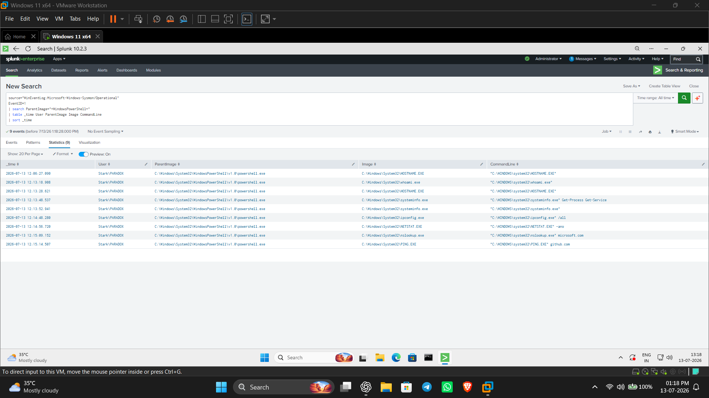
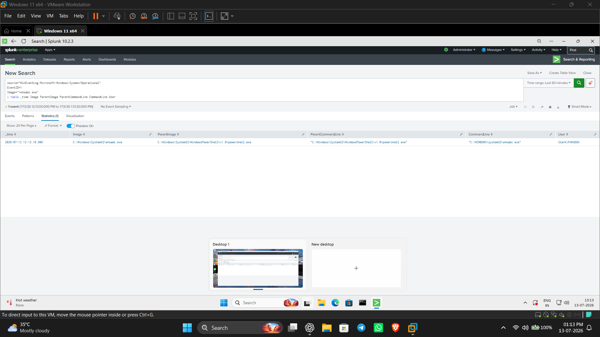
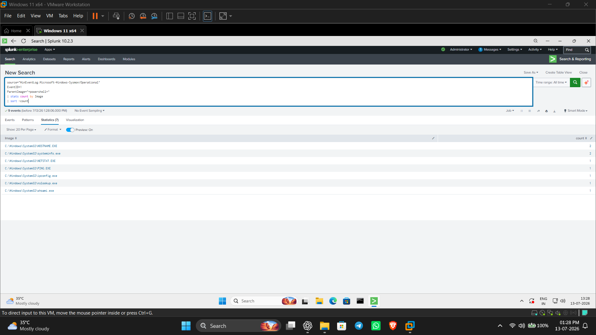
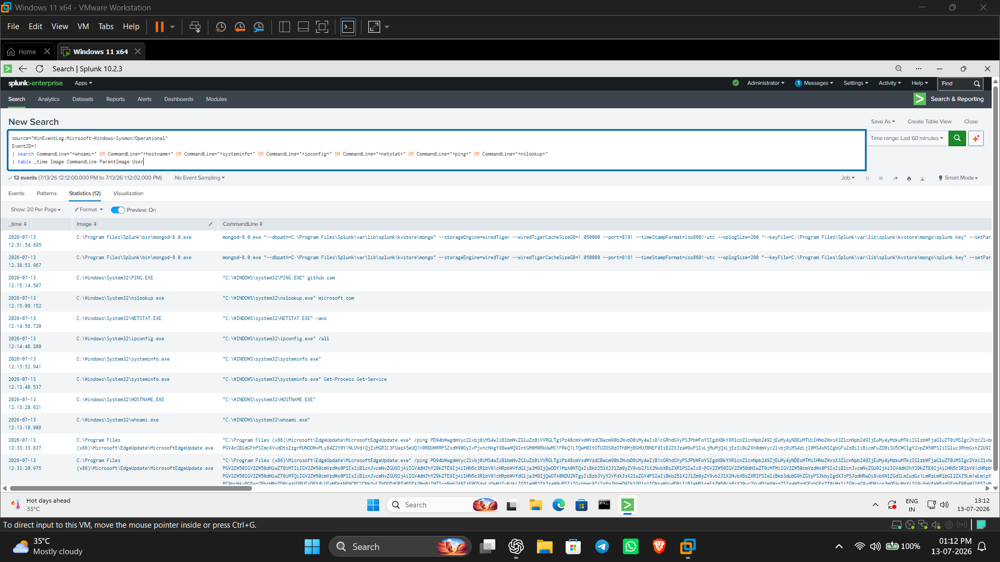
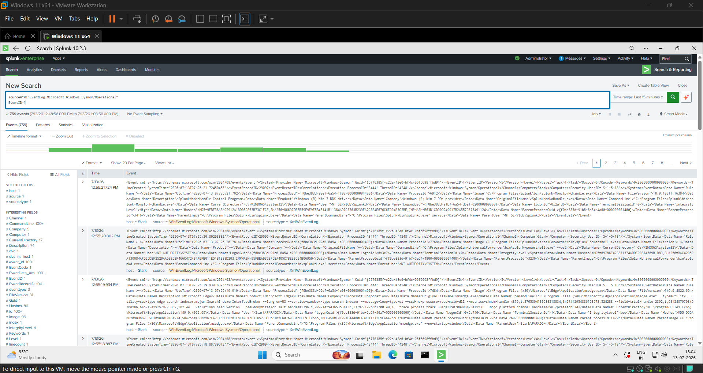

# Windows Reconnaissance Detection Lab using Splunk & Sysmon

## Project Overview

This project demonstrates how Windows reconnaissance activity can be detected using **Sysmon** and **Splunk Enterprise**. The objective was to simulate common post-compromise reconnaissance commands, collect telemetry with Sysmon, investigate the generated logs in Splunk, and develop SPL queries to identify similar behavior.

This lab focuses on process creation events (Sysmon Event ID 1) and reconstructs the attack timeline using parent-child process relationships and command-line analysis.

---

## Objectives

- Simulate attacker reconnaissance on a Windows endpoint
- Collect Windows telemetry using Sysmon
- Forward logs to Splunk Enterprise
- Investigate process creation events
- Develop SPL detection queries
- Map the observed behavior to MITRE ATT&CK

---

## Lab Environment

| Component | Version / Description |
|----------|------------------------|
| Operating System | Windows 11 Virtual Machine |
| SIEM | Splunk Enterprise |
| Log Forwarder | Splunk Universal Forwarder |
| Endpoint Logging | Sysmon |
| Event Source | Microsoft-Windows-Sysmon/Operational |

---

## Lab Architecture

```
+-------------------------+
| Windows 11 Virtual Machine |
|---------------------------|
| Sysmon                   |
| Splunk Enterprise         |
| Universal Forwarder       |
+-------------+-------------+
              |
              | Sysmon Event Logs
              v
+---------------------------+
| Splunk Search & Analysis  |
+---------------------------+
```

---

## Attack Simulation

The following reconnaissance commands were executed from PowerShell to generate telemetry.

```powershell
whoami
hostname
systeminfo
Get-Process
Get-Service
ipconfig /all
netstat -ano
nslookup github.com
ping github.com
```

The purpose of these commands was to simulate host discovery activities commonly observed during the early stages of an intrusion.

---

## Investigation Methodology

The investigation followed these steps:

1. Verified Sysmon Event ID 1 logs.
2. Identified PowerShell as the parent process.
3. Examined command-line arguments.
4. Correlated parent-child process relationships.
5. Reconstructed the execution timeline.
6. Developed SPL detection queries.

---

## Detection Queries

### Timeline Search

```spl
source="WinEventLog:Microsoft-Windows-Sysmon/Operational"
EventID=1
```

---

### Process Investigation

```spl
source="WinEventLog:Microsoft-Windows-Sysmon/Operational"
EventID=1
Image="*whoami.exe"

| table _time Image ParentImage ParentCommandLine CommandLine User
```

---

### Reconnaissance Statistics

```spl
source="WinEventLog:Microsoft-Windows-Sysmon/Operational"
EventID=1
ParentImage="*powershell*"

| stats count by Image
| sort -count
```

---

### Detection Query

```spl
source="WinEventLog:Microsoft-Windows-Sysmon/Operational"
EventID=1

| search CommandLine="*whoami*" OR
CommandLine="*hostname*" OR
CommandLine="*systeminfo*" OR
CommandLine="*ipconfig*" OR
CommandLine="*netstat*" OR
CommandLine="*ping*" OR
CommandLine="*nslookup*"

| table _time Image CommandLine ParentImage User
| sort _time
```

---

## MITRE ATT&CK Mapping

| Technique | ATT&CK ID |
|-----------|-----------|
| Command and Scripting Interpreter: PowerShell | T1059.001 |
| System Owner/User Discovery | T1033 |
| System Information Discovery | T1082 |
| System Network Configuration Discovery | T1016 |
| System Network Connections Discovery | T1049 |

---

## Investigation Evidence

### Reconnaissance Timeline



---

### whoami Process Investigation



---

### Reconnaissance Statistics



---

### PowerShell Process Creation



---

### Raw Sysmon Events



---

## Project Structure

```
Reconnaissance-Detection-Lab/
│
├── README.md
├── detection/
├── docs/
├── queries/
└── screenshots/
```

---

## Skills Demonstrated

- Splunk Enterprise
- SPL (Search Processing Language)
- Sysmon Log Analysis
- Windows Event Investigation
- Parent-Child Process Analysis
- Process Creation Monitoring
- Threat Hunting
- Detection Engineering
- MITRE ATT&CK Mapping
- Security Operations Center (SOC) Investigation

---

## Key Findings

- Successfully generated Windows reconnaissance telemetry.
- Verified Sysmon Event ID 1 process creation logging.
- Identified PowerShell as the parent process for reconnaissance commands.
- Developed reusable SPL queries to detect similar behavior.
- Reconstructed the attack timeline using process creation events.

---

## Future Improvements

- Detect encoded PowerShell commands
- Monitor network connections (Sysmon Event ID 3)
- Detect PowerShell download activity
- Create Splunk dashboards and alerts
- Expand detections using Sigma rules
